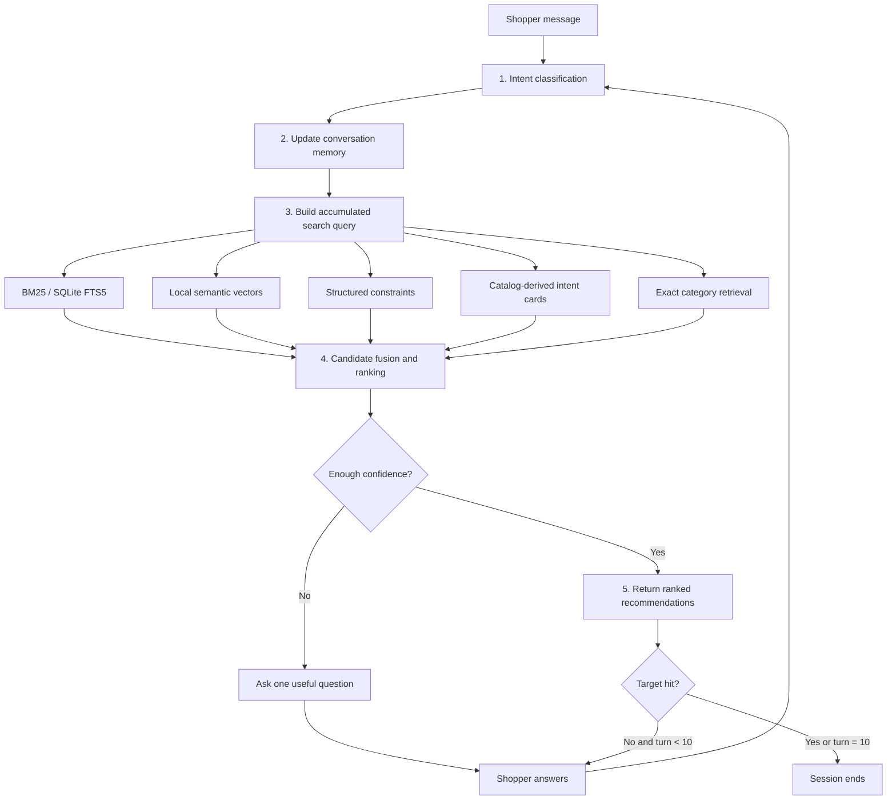

# TurnWise Shopping Copilot — Implementation Guide

## 1. Purpose

TurnWise is a deterministic conversational product-search agent for TechJam
Track 4. Its objective is to place the shopper's hidden target product as high
as possible in a list of at most 10 `parent_asin` values, and to find it in as
few conversation turns as possible.

The solution is implemented independently in `starter/agent.py`. It uses only
the frozen catalog and information revealed during the current conversation.
It optionally uses Gemini 3.5 Flash-Lite for natural-language intent
parsing (see `docs/llm_intent_architecture.md`) and falls back to pure
deterministic parsing when no API key is available.

## 2. System Flow

Every shopper reply repeats the same five-stage loop:



The agent can return recommendations and ask a clarification question in the
same response. The evaluator stops immediately when the target appears in the
scored Top 10.

## 3. Five Core Components

### 3.1 Intent classification

Intent classification uses a hybrid pipeline (`HybridIntentParser`):

1. **Template detection** — verbatim simulator messages are routed to the
   deterministic `IntentClassifier` regex parser (fast path, preserves
   baseline scores).
2. **Gemini 3.5 Flash-Lite** — all other messages are sent to the LLM for
   structured JSON intent extraction (mode, constraints, negations,
   no-preference signals, confidence score).
3. **Deterministic fallback** — if the API key is missing, the call times
   out, or the LLM confidence is below 0.5, the regex parser handles the
   message instead.

The parser routes into one of three modes:

- **Browsing:** the shopper is still exploring or has given few constraints.
- **Buying:** the shopper has supplied a price or multiple concrete
  requirements.
- **Override:** the shopper replaces an earlier preference using phrases such
  as “actually”, “instead”, or “ignore my earlier preference”.

Beyond mode detection, the LLM also extracts negative constraints (explicit
exclusions like “no leather”), no-preference signals, and add/remove
constraint operations that the regex parser cannot capture.

The detected mode changes retrieval and ranking weights. The original session
mode is also retained so a later vague response does not erase the difference
between a buying and browsing journey. See `docs/llm_intent_architecture.md`
for the full architecture and failure modes.

### 3.2 Conversation memory

`ConversationMemory` is stored separately for every `session_id`. It tracks:

- all conversation messages;
- active messages used for retrieval;
- the current and previous intent;
- attributes already asked about;
- attributes for which the shopper has no preference;
- whether the conversation is a boundary case;
- the most recent override turn;
- a stable Top-10 recommendation ladder and its current position.

When an override occurs, obsolete preferences are retired instead of appended
to the new request. The broad product category from the opening message is
preserved, the recommendation ladder is reset, and retrieval starts again with
the replacement intent.

“No preference” answers are remembered but excluded from the search query so
phrases such as “no preference for color” do not accidentally become positive
product requirements.

### 3.3 Product search

Five local retrieval routes operate over visible catalog fields:

| Route | Implementation | Best suited for |
|---|---|---|
| BM25 | SQLite FTS5 | Exact keywords, titles, brands and attributes |
| Semantic search | Deterministic hashed vectors with cosine similarity | Synonyms and meaning-level similarity |
| Structured constraints | Sparse TF-IDF postings | Multiple explicit requirements |
| Intent-card index | Exact matching of catalog-derived feature clauses | Requirements disclosed by the simulator |
| Category index | Exact coarse-category groups | Broad browsing and late-turn exploration |

The semantic encoder normalizes useful equivalents before vectorization, such
as `sneakers → shoe`, `comfy → comfortable`, and `rainproof → waterresistant`.
Product vectors are computed once during agent startup. Only the current query
is encoded on each turn.

Catalog-derived intent cards use only visible fields such as features, details,
material, color, and price. They reproduce the type of structured requirements
revealed during a conversation without reading hidden evaluator labels.

The ordered-prefix index retains the catalog clause order used during gradual
disclosure. Exact-category products matching a longer consecutive prefix rank
ahead of unordered partial matches. Constraint normalization is Unicode-safe,
so non-English catalog clauses remain searchable.

### 3.4 Ranking

`HybridRanker` merges BM25, semantic, evidence, and popularity rankings using
intent-aware Reciprocal Rank Fusion (RRF):

```text
RRF(product) = Σ route_weight / (fusion_k + route_rank(product))
```

The evidence route combines:

- structured-constraint rank;
- phrase-coverage rank;
- catalog-derived intent-card rank;
- intent cards filtered to the exact category;
- previous-intent rank after an override.

For intent overrides, a slot reconciler combines the retired conversation's
catalog-clause coverage with the newly revealed hard constraint. This preserves
useful history without treating superseded preferences as current filters.

Category-filtered intent evidence is important when a generic requirement such
as “cotton” matches many products across the entire catalog.

The response policy initially exposes a small number of high-confidence items.
It then walks through a stable Top-10 ladder, exposing the first four candidates
individually before returning the remaining batch. Successive turns therefore
provide new coverage without randomly reshuffling the same products. If the
original Top 10 is exhausted, controlled prefix, category, or previous-intent
exploration is used on later turns.

### 3.5 Response construction and validation

`ResponseBuilder` returns the evaluator contract:

```python
{
    "message": "What else matters most to you about the product?",
    "ask_attribute": "other",
    "recommendations": [
        {"parent_asin": "B000...", "score": 0.123}
    ],
    "usage": {"prompt_tokens": 0, "completion_tokens": 0}
}
```

The final output contains:

- a natural-language response string;
- one valid `ask_attribute`;
- no more than 10 ranked catalog identifiers;
- no duplicate identifiers;
- cumulative session token usage from the optional LLM layer (zero when no key is set).

## 4. Clarification Strategy

The agent begins with the open-ended `other` attribute because the simulator
can reveal up to two undisclosed high-value constraints in one response. Once
open-ended clarification is exhausted, it moves through specific attributes:

```text
material → color → style → use_case → feature → budget → brand → size → category
```

Previously declined attributes are skipped. A boundary response such as “I
don't have a preference; use your judgment” is treated as useful state rather
than added to the search query.

## 5. Turn-Aware Recommendation Policy

The policy balances all three scoring objectives:

- **Hit Rate@10:** use diverse retrieval routes and late-turn exploration.
- **MRR:** return only the highest-confidence candidate on early turns.
- **MTTC:** ask broad, high-information questions while simultaneously showing
  current recommendations.

For stable intent, the agent snapshots its Top 10 and exposes it progressively.
For an override, it first explores candidates related to the retired intent,
then reranks them using the newly disclosed requirement. This helps recover the
true target when the changed requirement alone is too generic.

## 6. Setup and Execution

Python 3.10 or later is recommended.

```bash
python -m pip install -r requirements.txt
```

Place the decompressed catalog at `data/catalog.jsonl`, or pass its path
explicitly:

```bash
python -m evaluator.local_evaluator \
  --catalog data/catalog.jsonl \
  --output results.json
```

Run the complete test suite:

```bash
python -m unittest discover -s tests -v
```

## 7. Verified Results

The finalized deterministic implementation was evaluated twice with identical
results:

| Test set | Sessions | Hit Rate@10 | MRR | MTTC | Efficiency | TechnicalScore |
|---|---:|---:|---:|---:|---:|---:|
| Default public | 200 | 1.000 | 0.990833 | 2.235 | 0.8765 | **0.972550** |
| Extended holdout | 500 | 0.996 | 0.988233 | 2.382 | 0.8618 | **0.966830** |

The score is calculated as:

```text
Efficiency = clip((11 - MTTC) / 10, 0, 1)
TechnicalScore = 0.50 × HitRate@10 + 0.30 × MRR + 0.20 × Efficiency
```

The unit and evaluator-contract suite contains 28 passing tests. Aggregate
machine-readable results are stored in `docs/independent_agent_results.json`.

## 8. Runtime Characteristics

- Optional Gemini 3.5 Flash-Lite calls for intent parsing (key read from `.env` automatically).
- Falls back to fully deterministic parsing when no key is set — no network access needed.
- No hosted service or external vector database.
- All indexes are in memory; BM25 uses an in-memory SQLite database.
- Product vectors are precomputed once at startup.
- Token usage is tracked per session and reported in every response.
- Retrieval and ranking are deterministic for a fixed catalog and conversation.

## 9. Data and Leakage Safety

The runtime agent does not contain public or extended sample IDs, target ASIN
mappings, or target-specific rules. It never reads evaluator ground-truth
labels. Ranking is based only on catalog fields, anonymous profile information,
and conversation messages supplied through the official agent interface.

## 10. Main Files

| File | Purpose |
|---|---|
| `starter/agent.py` | Complete five-stage agent and required interface |
| `starter/intent_parser.py` | LLM intent layer (Gemini + deterministic fallback) |
| `tests/test_agent_pipeline.py` | Intent, memory, retrieval, ranking and contract tests |
| `tests/test_intent_parser.py` | Intent parser unit tests (42 tests, all mocked) |
| `tests/test_adversarial_holdout.py` | Adversarial holdout schema tests |
| `tests/test_evaluator.py` | Evaluator normalization and metric tests |
| `scripts/evaluate_datasets.py` | Score agent against default + extended datasets |
| `scripts/evaluate_robust.py` | Paraphrase/noise generalization evaluator |
| `scripts/evaluate_splits.py` | Multi-split evaluator with locked-test safety |
| `evaluator/local_evaluator.py` | Official local evaluator (participant kit) |
| `evaluator/custom_evaluator_1*.py` | Persona-based custom evaluator (4 files) |
| `requirements.txt` | NumPy dependency for local vectors |
| `docs/llm_intent_architecture.md` | LLM integration architecture and failure modes |
| `docs/independent_agent_results.json` | Final aggregate benchmark results |
| `docs/agent_api_contract.json` | Official response contract |

## 11. Future Improvements

Potential improvements that preserve the current design include:

- replacing feature hashing with a compact local sentence-embedding model;
- learning route weights from public rank features with strict cross-validation;
- estimating question value from candidate entropy;
- adding richer attribute parsing for numeric size and price ranges;
- splitting `starter/agent.py` into internal `state`, `intent`, `retrieval`,
  `ranking`, and `policy` modules while keeping the official interface stable.
