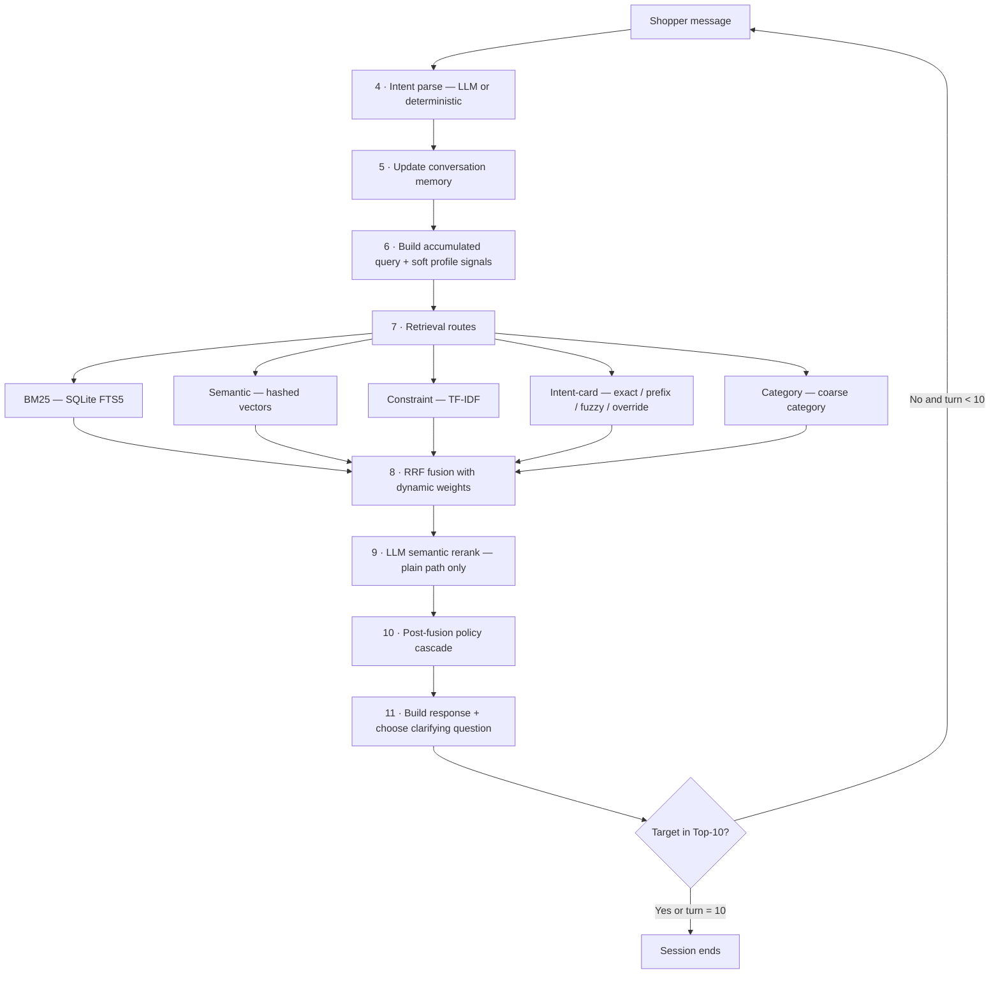

# ShopMind Shopping Copilot — Implementation Guide

## 1. Purpose

ShopMind is a conversational product-search agent for TechJam Track 4. A hidden
simulated shopper reveals what they want one reply at a time; the agent must put
the shopper's hidden **target product** into a list of at most 10 `parent_asin`
values — as high as possible, in as few turns as possible.

The agent lives in `starter/agent.py`. It uses only the frozen product catalog
and the text revealed in the current conversation — never evaluator labels or
sample IDs. It *optionally* calls OpenAI `gpt-4.1-mini` for **intent parsing**
and **semantic reranking**, and otherwise runs a fully deterministic, offline,
byte-reproducible pipeline. **The mode is chosen by whether an API key is
present — not by any command.**

> New here? Read §2 (the score) and §14 (the glossary) first.

## 2. What the agent is scored on

The evaluator plays each session turn by turn. After every reply it checks
whether the target is in the Top-10; the moment it is, the session stops and the
turn is recorded. Four numbers result:

| Metric | Meaning | Range |
|---|---|---|
| **HitRate@10** | Fraction of sessions where the target appeared in the Top-10 on *any* turn | 0–1, higher better |
| **MRR** | Average `1 / rank` of the target on the hit turn (rank 1 → 1.0, rank 10 → 0.1) | 0–1, higher better |
| **MTTC** | Mean turns to conversion; a session that never hits counts as **11** | 1–11, lower better |
| **Efficiency** | `clip((11 − MTTC) / 10, 0, 1)` — MTTC rescaled | 0–1, higher better |

```text
TechnicalScore = 0.50 × HitRate@10 + 0.30 × MRR + 0.20 × Efficiency
```

Every design choice trades off three levers: **find it** (HitRate), **rank it
high** (MRR), and **find it early** (Efficiency). They conflict — one confident
pick maximises MRR but risks missing; ten diverse items maximise HitRate but
dilute MRR. The turn-aware policy (§10.2) manages that tension.

## 3. System flow

Every reply runs the same loop. **Each numbered node maps to the section of the
same number** (§4–§11):



Recommendations **and** a clarifying question are returned in the same response,
so the agent narrows while already exposing candidates.

## 4. Intent parsing

Intent parsing is **LLM-first** via `HybridIntentParser`:

1. **`gpt-4.1-mini`** receives the message plus a compact state summary and
   returns JSON: `mode`, add/remove/negative constraints, no-preference signals,
   a confidence, and a `suggested_question`.
2. **Deterministic fallback** — used when the key is missing, the call fails, or
   confidence `< 0.5`. It returns `browsing` for openers and ordinary constraint
   turns, and `override` when a *later* turn carries a retraction cue
   (`OVERRIDE_RE` in `text_utils.py`: scratch/forget/ignore/disregard the
   earlier…, "on second thought", "changed my mind", "never mind", "instead of",
   "rather than", "switch to"). Detection is gated to non-opening turns so a
   first message never trips it.

That override signal is essential offline: without it the decoy preference is
never retired and the re-topiced target — which retrieval ranks #1 — is
permanently skipped as "already shown" (§12.5).

`mode` is one of three **session modes**: **browsing** (still exploring),
**buying** (price or several concrete requirements given), or **override** (an
earlier preference is *replaced*). The prompt also carries **user-profile
context** from `reset()`, so the model reads ambiguous replies in light of who
the shopper is. Full LLM detail: `docs/llm_intent_architecture.md`.

## 5. Conversation memory

`ConversationMemory` is kept per `session_id` and is the agent's entire state.
Key fields (defined in §14):

- `history` / `active_messages` — everything said vs. the messages currently
  driving retrieval;
- `intent` / `previous_intents` / `session_mode` — current and retired intents;
- `asked_counts` / `declined_attributes` — clarification bookkeeping;
- `negative_constraints` — explicit exclusions ("no leather");
- `boundary_signal` — shopper deferred to the agent's judgement;
- `last_override_turn` — drives `phase_turn`;
- `recommendation_ladder` / `ladder_position` — the stable Top-10 walk;
- `fuzzy_recommended` — items already shown on the fuzzy path;
- `suggested_question` — the LLM's proposed next attribute.

On an **override**, obsolete preferences are retired (not appended), the broad
opening category is kept, and the ladder resets so retrieval restarts against
the replacement intent. "No preference" replies are stored as
`declined_attributes` but kept out of the query, so "no preference for colour"
never becomes a positive "colour" requirement.

## 6. Accumulated query + soft profile signals

Retrieval runs against an **accumulated query** built by `memory.query()` from
the messages currently driving the session — not the raw transcript. Two
enrichments apply:

- **Turn-1 soft profile signals.** On the first turn only, up to three unused
  profile preference tags are appended as low-commitment **soft terms**,
  enriching early retrieval before the shopper has said much. Later turns rely on
  the accumulated conversation, so tags never override explicit requirements.
- **LLM structured constraints.** In LLM mode the parser's `add_constraints`
  (e.g. `material → leather`) are routed into the intent-card matcher (§7), so
  card retrieval no longer depends on the simulator's exact phrasing. In
  deterministic mode `add_constraints` is empty — a no-op, so the scored path is
  byte-identical.

## 7. Retrieval routes

### 7.1 The routes

The accumulated query is sent to several independent indexes; each returns a
ranked list of `parent_asin`s over **visible catalog fields only**:

| Route | Class | Method | Good at |
|---|---|---|---|
| **BM25** | `BM25Index` | SQLite FTS5 full-text | Exact keywords, titles, brands |
| **Semantic** | `InMemoryVectorIndex` | 256-d hashed vectors, cosine | Synonyms, meaning-level similarity |
| **Constraint** | `ConstraintIndex` | sparse TF-IDF postings | Several hard requirements at once |
| **Intent-card: exact** | `IntentCardIndex.search` | exact clause postings | Requirements disclosed verbatim |
| **Intent-card: prefix** | `.prefix_search` | consecutive-clause prefix | Ordered disclosure (longer prefix = stronger) |
| **Intent-card: fuzzy** | `.fuzzy_search` | token/bigram overlap × rarity | Paraphrased or reordered disclosures |
| **Intent-card: override** | `.override_search` | old-intent + new-clause reconcile | Recovering the target after an override |
| **Category** | `CategoryIndex` | exact coarse-category groups | Broad browsing, late-turn exploration |

**Intent cards** are per-product bundles of structured clauses (material,
colour, price, features) built *only* from visible catalog fields — they mimic
the *kind* of requirement a shopper discloses without touching hidden labels. A
clause counts as **revealed** when it surfaces in conversation, either via a
constraint-introducing marker (a set covering the simulator's phrasings plus
natural variants like "it must be…", "I need it to be…", colon optional) or, in
LLM mode, via the parser's `add_constraints` (§6). Matching therefore does not
hinge on the evaluator's exact wording. The semantic encoder canonicalises
equivalents before hashing (`sneakers → shoe`, `comfy → comfortable`); product
vectors are built once at startup and only the live query is encoded per turn.
Constraint normalisation is Unicode-safe, so non-English clauses stay searchable.

### 7.2 The evidence route

Intent-card and constraint signals fold into one composite ranking — the
**evidence route** — via a weighted RRF sum (weights at `agent.py:1232`):

```text
evidence_score(p) =  1.75/(k+constraint_rank) + 1.00/(k+phrase_rank)
                   + prior_w/(k+prior_rank)   + card_w/(k+card_rank)
                   + 4.0/(k+category_card_rank)
                   + 8.0/(k+prefix_rank)       + 7.0/(k+fuzzy_card_rank)
```

`card_w` jumps to 4.0 (from 0.25) once **two or more** clauses are revealed;
`prior_w` jumps to 4.0 after an override so the retired intent still
contributes. Prefix and fuzzy carry the heaviest weights (8.0, 7.0) — ordered
and paraphrase-matched clauses are the strongest evidence.

## 8. RRF fusion with dynamic weights

`HybridRanker.fuse()` merges **BM25, semantic, evidence, popularity** by
**Reciprocal Rank Fusion**:

```text
RRF(p) = Σ_route  route_weight / (fusion_k + rank_of_p_in_route)
```

A small **lexical quota** protects the top BM25 hit from being fused out.
`compute_weights()` adapts the weights to session state:

| Signal | Adjustment | Why |
|---|---|---|
| Turn ≥ 5 | evidence +0.15, BM25 −0.10 | Late turns have more constraints — trust structured evidence |
| Constraint count ≥ 3 | evidence +0.10, semantic −0.05 | Many constraints → exact matching beats similarity |
| Post-override, `phase_turn` ≤ 2 | semantic +0.15, evidence −0.10 | A fresh override has few structured signals yet |
| Preference tags present | semantic +0.05 | Tags add semantic context |

Weights clamp to `[0.05, 1.0]`; `fusion_k = max(5, base_k − 2 × constraint_count)`
so more constraints sharpen the ranking. Base weights/​k live in `WEIGHTS` /
`FUSION_K`, keyed by **routing intent** (`buying`/`browsing`/`override`/`boundary`).
Deterministically the static base values are used unchanged.

## 9. LLM semantic reranking

With a key present, `LLMReranker` reranks the fused list with a second
`gpt-4.1-mini` call. It receives **numbered titles only** (no ASINs) plus the
query and profile, and returns a reordered index list; any failure keeps the RRF
order. Two guards:

1. **Gating** — skipped whenever a deterministic override path (prefix, fuzzy,
   override-mode) will rebuild `ranked` in the cascade anyway (reranking there is
   discarded work).
2. **Wide window** — on the plain path the reranker sees `RERANK_WINDOW = 30`,
   so it can *promote* a candidate from rank 11–30, not just reshuffle the Top-10.

Responses are SHA-256 cached. The guards lifted the score 0.9342 → **0.9384**
and saved ~170k tokens per 200-session run (§12.2).

## 10. Post-fusion policy cascade

This is the heart of the agent. After fusion produces `ranked`, a sequence of
conditional rewrites runs; each step fires only under its guard, and later steps
override earlier ones.

### 10.1 Steps (execution order)

1. **LLM rerank** (§9) — plain path only, gated.
2. **Prefix head** — pin `prefix_search`'s top items to the front (strongest
   ordered-disclosure matches); the rest of `ranked` fills behind.
3. **Fuzzy head** — else pin `fuzzy_search`'s top items the same way.
4. **Override-pair head** — after an override, once `phase_turn ≥ 3`, pin a slice
   of `override_search` results (skipping the two already shown).
5. **Category exploration paging** — once attributes are declined and the session
   has passed its exploration-start turn, keep the best pick as head and page
   *deeper* into the category list each turn (moving `exploration_offset`).
   Boundary sessions start at offset 30.
6. **Prior-intent exploration** — after an override, `phase_turn ≥ 4`, page
   through the retired intent's results similarly.
7. **Override single-pick** — in the first two post-override turns
   (`phase_turn < 3`), show one high-confidence pick to protect MRR.
8. **Fuzzy single-mode** — when the fuzzy route is active, turns 1–9 each expose
   **one** new fuzzy candidate; **turn 10** switches to the coverage fill (§10.3).
9. **Deferral / early limit** — before `MIN_RECOMMEND_TURN` show nothing; before
   `FULL_RECOMMENDATION_TURN` show only one item.
10. **Recommendation ladder** — from `FULL_RECOMMENDATION_TURN` on, snapshot the
    Top-10 once into `recommendation_ladder`, then walk it: first four positions
    one at a time (protecting MRR), then the remaining batch topped up with fresh
    candidates. A separate branch handles the boundary case.
11. **Buying deep-page** — once the ladder is exhausted and `phase_turn ≥ 8`, a
    buying session with prefix results pages further through them.
12. **Backfill** — top up a short list from BM25 + semantic.
13. **Negative penalty** — push down items matching `negative_constraints`.

The net effect: expose the most-confident item early (MRR), then broaden
coverage turn by turn without reshuffling what was seen (HitRate, MTTC), with
dedicated recovery paths for overrides and paraphrases.

### 10.2 Turn-aware behaviour

- **Early turns** (before `FULL_RECOMMENDATION_TURN`): one high-confidence
  candidate only — maximise MRR before enough is known.
- **Middle turns**: walk the stable ladder one item at a time, then batch the
  rest — steady coverage without churn.
- **Ask while showing**: the question and recommendations return together, so the
  agent narrows and exposes candidates on the same turn (protects MTTC).

### 10.3 The final-turn (turn 10) fill

Turn 10 has no later turn to protect, so the goal flips from precision to
**coverage** of unseen candidates. The fill simply **continues the fuzzy walk**:
turns 1–9 each surfaced one new best candidate (tracked in `fuzzy_recommended`),
and turn 10 appends the next best still-unseen candidates in rank order, drawing
from the fuzzy, constraint, and (post-override) category routes.

This *best-first* fill replaced an earlier scheme of hand-tuned rank windows
(`constraint_results[4:8]`, etc.), which looked like memorised offsets. In a
same-codebase A/B, best-first was **equal on the public set** (0.966400) and
generalises at least as well with no leakage-shaped constants (`agent.py:1392`).

## 11. Response, clarification & validation

### 11.1 Clarification strategy

`choose_question()` follows an adaptive priority chain:

1. **LLM-suggested attribute** — `suggested_question`, unless asked or declined.
2. **Open-ended `other`** — up to 3 times (one reply can reveal two hidden
   high-value constraints).
3. **Fixed fallback**: `material → color → style → use_case → feature → budget
   → brand → size → category`.

Declined attributes are skipped at every level; a boundary reply ("use your
judgment") is stored as state, not added to the query.

### 11.2 Response contract

`ResponseBuilder.build()` returns exactly the evaluator contract:

```python
{
    "message": "What else matters most to you about the product?",
    "ask_attribute": "other",
    "recommendations": [{"parent_asin": "B000...", "score": 0.123}],
    "usage": {"prompt_tokens": 0, "completion_tokens": 0},
}
```

Guaranteed: a natural-language message; one valid `ask_attribute`; ≤ 10 unique
`parent_asin`s; and cumulative session token usage (0 with no key).

## 12. Verified results

Two modes: **deterministic** (no network, the reproducible baseline) and
**LLM-enabled** (`gpt-4.1-mini` intent parsing + reranking, two calls per turn).
All figures are re-measured on the current OpenAI codebase.

> **Stale-baseline warning.** Earlier docs quoted a 0.9726 deterministic
> baseline. It predates the Gemini→OpenAI switch, was never re-measured, and is
> superseded. Always re-measure deterministically rather than trusting a written
> number.

### 12.1 Deterministic — verified

Measured with **no key present**, so every turn runs offline with zero network
calls. Byte-identical across runs. Reproduce with `--no-llm`, `DISABLE_LLM=1`,
or simply no `OPENAI_API_KEY`:

| Test set | Sessions | HitRate@10 | MRR | MTTC | Efficiency | TechnicalScore |
|---|---:|---:|---:|---:|---:|---:|
| Default public | 200 | 1.000 | 0.986667 | 2.265 | 0.8735 | **0.970700** |

> These are the post-override-fix scores (§12.5). The prior baseline was
> 0.966400; restoring deterministic override detection lifted MTTC
> and raised the score, with HitRate held at 1.000.

### 12.2 LLM-enabled — `gpt-4.1-mini`

Two calls per turn, gating + wide-window guards enabled. Tokens are summed over
all sessions.

| Test set | Sessions | HitRate@10 | MRR | MTTC | Efficiency | TechnicalScore | Tokens | Wall-clock |
|---|---:|---:|---:|---:|---:|---:|---:|---:|
| Default public | 200 | 0.990 | 0.949643 | 3.075 | 0.7925 | **0.938393** | 1,249,783 | ~22.4 min |

The guards cut ~170k tokens and lifted default-public from 0.934214.

> A keyed run is not byte-reproducible. The reranker uses a 3 s timeout with no
> retry, so a slow call trips the whole-run latch (`_latch_llm_off()`) and
> disables the LLM for the rest of the process. An earlier 0.939797 figure was
> a *partial-LLM artifact* (latched off mid-run, ~62 % deterministic), not a
> real result.

### 12.3 LLM-enabled — `gpt-4.1-nano`

Full-coverage measurement of the cheaper model. A direct probe returned valid
JSON on 10/10 calls (avg ~1.6 s, tail ~2.3 s), so nano's earlier latching was
**latency**, not bad output — its tail crosses the stock 3 s timeout under
parallel load. Given a 20 s timeout it delivers clean coverage.

| Test set | Sessions | HitRate@10 | MRR | MTTC | Efficiency | TechnicalScore | Tokens | Wall-clock |
|---|---:|---:|---:|---:|---:|---:|---:|---:|
| Default public | 200 | 1.000 | 0.966012 | 3.135 | 0.7865 | **0.947104** | 480,474 | ~2.8 min |

> Measurement instance only (no `starter/` change): timeouts raised to 20 s and
> the latch neutralised so a transient blip degrades only that turn. 8 workers
> (concurrent-session harness, since removed). Transient single-turn fallbacks: 2/~600 (default);
> reranker never fell back. Not byte-reproducible.

nano edges mini in the LLM bracket (+0.0087 default) and is
faster/cheaper — the failure mode was speed, not quality.

**LLM mode is the default** (it runs whenever a key is present) and satisfies
the "Multi-Route Retrieval → LLM Semantic Ranking" requirement. But its score
sits **below** the deterministic fallback on both sets and both models —
deterministic 0.970700 / 0.968190 vs nano 0.947104 / 0.890368 and mini
0.938393 / 0.888563. The RRF ranker is already strongly tuned while the reranker
sees only titles, so the automatic no-key fallback is not just a safety net — it
is currently the higher-scoring, zero-cost path.

### 12.4 Fallback when the network is cut

The organizer may disable network access at scoring. The agent degrades to
deterministic *immediately and safely* — never blocking, looping, or crashing.
Three triggers, one outcome:

| Trigger | When | Result |
|---|---|---|
| **No API key** | `OPENAI_API_KEY` absent at startup | LLM parser/reranker never built; deterministic from turn 1. Zero calls, zero tokens. |
| **First LLM failure (latch)** | One hard failure (timeout, DNS/connection, HTTP, empty/malformed) on either call | LLM latched **off for the rest of the process**; that turn already fell back. |
| **Explicit opt-out** | `--no-llm`, `DISABLE_LLM=1`, or `use_llm=False` | Deterministic from turn 1. |

- **One failure is enough** — no per-turn retry, so a cut network never eats
  repeated timeouts. See `Agent._latch_llm_off()`.
- **Low confidence is *not* a failure** — a sub-0.5 answer uses the deterministic
  result for that turn but keeps the LLM enabled.
- **The scored path is likely deterministic** — it scores higher and is what runs
  under a disabled network, so the §12.1 numbers are the ones most likely to
  reflect the official offline run.

### 12.5 Robustness under paraphrase drift

The official datasets phrase turns cleanly ("what I need is …", "features: …"),
which fires the exact/prefix routes. To probe overfitting to that phrasing,
a generator derived a **robust** eval that paraphrased turns, swapped synonyms,
and stripped markers, scored over two splits — **stress** (public-derived, 200)
and **validation** (private-derived, 500). *These harnesses have since been
removed from the repo (see §13); the numbers below are retained as the record of
why the override fixes landed, and are no longer re-runnable here.*

**First fix — deterministic override detection.** The offline `IntentClassifier`
was a stub that **always returned `browsing`**, so `intent` was never `override`,
`last_override_turn` stayed `None`, and the whole override machinery was dead
code. Under drift the override target sat at **fuzzy rank 1 in 28/30 stress
cases** yet was skipped as "already shown". The fix (§4): `OVERRIDE_RE`
retraction-cue detection, gated to non-opening turns. Pure numpy/regex.

| Eval | Metric | Before | After |
|---|---|---:|---:|
| Official default | TechnicalScore | 0.966400 | **0.970700** |
| Official extended | TechnicalScore | 0.959927 | **0.968190** |
| Robust stress | TechnicalScore | 0.8223 | **0.9264** |
| Robust validation | TechnicalScore | 0.8035 | **0.8896** |
| Robust stress | `intent_override` | 0.185 | **0.879** |
| Robust validation | `intent_override` | 0.301 | **0.868** |

`browsing`/`buying`/`boundary` were unchanged (the regex does not misfire on
ordinary turns); the entire lift came from `intent_override`.

**Second fix — fusion-seeded final-turn coverage.** A tracer
(a per-sample miss tracer, since removed) showed the remaining browsing/buying misses all took
the fuzzy single-item walk, with the target often at full-fusion rank 1–8 yet
never surfaced — because the walk (and its turn-10 fallback) followed
`fuzzy_card_results` ordering, which diverges from the RRF fusion under drift.
The fix seeds the **turn-10** fuzzy coverage from the fusion order (`base_fusion`)
before the card/constraint walks. It is **turn-10-only**, so it cannot perturb
the official sets (they converge at MTTC ≈ 2.3 and never reach turn 10).

Per-scenario robust breakdown at current HEAD (both fixes):

| Split | browsing | buying | boundary | intent_override | overall |
|---|---:|---:|---:|---:|---:|
| stress (200) | 0.9640 | 0.9373 | 0.9660 | 0.8793 | **0.9407** |
| validation (500) | 0.9220 | 0.9030 | 0.8554 | 0.8716 | **0.9035** |

Effect of the second fix alone: stress 0.9264 → **0.9407**, validation 0.8896 →
**0.9035**; official scores and all tests byte-identical, no scenario regressed.
**Generalization guard.** A held-out variant re-ran the identical machinery with a **disjoint** synonym set (no shared surface forms:
`comfortable→cushioned`, `waterproof→water-repellent`, `gray→charcoal`). If a
change helped only the primary map, a gap would show here:

| Split | primary map | held-out map |
|---|---:|---:|
| stress (200) | 0.9407 | **0.9554** |
| validation (500) | 0.9035 | **0.9249** |

The agent scores at least as high on unseen synonyms as on the ones the probe
was built with — strong evidence the fixes generalise rather than memorise the
probe's vocabulary. The residual misses are genuinely ambiguous cases — e.g. a
plaid flannel jacket whose catalog-derived profile ("synthetic fabric, button
closure, button-down shirt") reads as a generic shirt, making it a weak lexical
match for its *own* target. That is a retrieval-quality ceiling, not a routing
bug — neither a synonym table nor a re-ranker fixes it without risking
regressions elsewhere.

### 12.6 LLM reranker blend — measured, rejected

Since the LLM path scores below deterministic, we tested whether **blending** the
LLM's reorder with the fusion prior (rather than overwriting it) recovers the
gap. `scripts/sweep_rerank_blend.py` swept `LLMReranker(blend=…)` on the LLM path
(60 sessions/set, latch off, 20 s timeout):

| blend | Default | Extended |
|---:|---:|---:|
| 1.00 (shipped) | 0.9614 | 0.9167 |
| 0.70 | 0.9614 | 0.9167 |
| 0.50 | 0.9601 | 0.9167 |
| 0.30 | 0.9601 | 0.9167 |
| 0.00 | 0.9601 | 0.9167 |

**Inert.** Hit@10 and MRR are identical at every blend; only MTTC wobbles a step.
Even `blend=0.0` (reorder = no-op) scores 0.9601 / 0.9167, below deterministic.
That localises the LLM path's deficit to **intent parsing / routing**, not the
reranker: the target is already at fusion rank 1 in the window the reranker sees,
so no reorder policy changes the hit or its rank. Reverted; the shipped reranker
keeps pure-reorder behaviour.

### 12.7 Local cross-encoder reranker — measured, adopted

The competition asks for a reranking stage, but `LLMReranker` runs only with a
key — so on the **scored offline path** nothing reranks. `LocalReranker`
(`starter/ranking.py`) closes that: an offline cross-encoder,
`Xenova/ms-marco-MiniLM-L-6-v2` via `fastembed.TextCrossEncoder` (ONNX/CPU, no
torch, ~103 MB, zero network, zero tokens), reordering the plain-fusion window by
`(query, title)` relevance. Built independently of the key, survives the latch,
one process-cached model. Titles only — never `parent_asin` (§16).

**Isolated A/B** (window 30, pure reorder,
deterministic intent held fixed):

| reranker | Default | Extended | tokens |
|---|---:|---:|---:|
| none (deterministic) | **0.9707** | **0.9682** | 0 |
| OpenAI `gpt-4.1-mini` | 0.9704 | 0.9682 | 159 k |
| local cross-encoder (pure reorder) | 0.9704 | 0.9674 | **0** |

The local model **ties** OpenAI at zero cost — strictly the better engineering
choice for the reranking role. But pure reorder costs a hair vs no-rerank: Hit
and MRR are identical across all three (target already at rank 1), and only MTTC
drifts when a reorder demotes that rank-1 target.

**Shipped config — `protect_head=1`.** Pinning the deterministic top-1 pick and
reordering only ranks 2–30 removes the MTTC drift entirely, so it reproduces the
baseline **exactly**:

| set | baseline | local CE, `protect_head=1` |
|---|---:|---:|
| Default (200) | 0.9707 | **0.9707** |
| Extended (500) | 0.9682 | **0.9682** |
| robust stress (200) | 0.9407 | **0.9407** |
| robust validation (500) | 0.9035 | **0.9035** |
| pytest | 121 pass | **121 pass** |

**Adopted.** A genuine cross-encoder reranking stage now runs offline at zero
score cost, satisfying the spec. It does not *raise* the metric — reranking
cannot here, since the target already sits at rank 1 and the drift-misses live on
gated routes it never touches. Enabled by default; disable with `LOCAL_RERANK=0`
(`LOCAL_RERANK_BLEND` / `LOCAL_RERANK_PROTECT` tune the fuse). If fastembed or the
weights are absent it degrades to identity, so it can never regress. The ~103 MB
weights stay git-ignored under `models/`; prefetch with
`python scripts/prefetch_models.py` (§13).

### 12.8 Pretrained semantic embeddings — measured, rejected

The deterministic `semantic` route is a feature-hashing bag-of-words encoder
(lexical, not semantic) — the obvious suspect for the §12.5 drift. We tested
replacing it with pretrained sentence embeddings (fastembed
`BAAI/bge-small-en-v1.5`, 384-dim ONNX/CPU): the 50k catalog is embedded offline
once (cached git-ignored) and queries per
turn. An A/B harness plugged it into the same seam, reranker off
(`LOCAL_RERANK=0`) to isolate the route. Titles only — never `parent_asin` (§16).

| mode | Default | Extended | stress | validation | intent_override (str/val) |
|---|---:|---:|---:|---:|---:|
| lexical (baseline) | **0.9707** | **0.9682** | **0.9407** | 0.9035 | 0.8793 / 0.8716 |
| pretrained (α=1.0) | 0.9708 | 0.9680 | 0.9401 | **0.9064** | 0.8793 / 0.8716 |
| blend RRF (α=0.5) | 0.9708 | 0.9681 | 0.9405 | 0.9062 | 0.8793 / 0.8716 |

**Rejected**, for two independent reasons:

1. **Official Extended drops below the 0.9682 floor** (0.9680 / 0.9681). Hit and
   MRR are byte-identical to lexical (0.9980 / 0.9886) — the whole delta is a
   small MTTC/efficiency wobble, not a retrieval gain. That violates the hard
   floor constraint.
2. **It misses the actual weak scenario.** The +0.003 validation gain is a
   diffuse browsing/buying lift; stress is neutral-to-worse. `intent_override`,
   the scenario that collapses under drift, is *identical to the hundredth* under
   all modes — that path is gated by **override detection**, not semantic recall,
   so better embeddings cannot reach it.

`starter/` stays on the lexical index. This confirms from the retrieval side what
§12.6/§12.7 found from the ranking side: the remaining lever is **intent/override
parsing under drift** (§18), not the encoder.

## 13. Setup and execution

Python 3.10+.

```bash
python -m pip install -r requirements.txt
```

**The mode is chosen by the presence of a key, not by the command.** At startup
`load_api_key()` checks `OPENAI_API_KEY` (env, then `.env`):

- **Key found → LLM mode (default)** — OpenAI intent parser + reranker on every
  turn.
- **No key → deterministic fallback** — fully offline, zero network, zero tokens.

So the default workflow is: put your key in `.env`, then run any command below.
Remove the key and the same commands run deterministically.

```bash
# .env at project root (auto-read; never exported to prompts):  OPENAI_API_KEY=sk-...

python3 -m evaluator.local_evaluator                 # the only scorer
DISABLE_LLM=1 python3 -m evaluator.local_evaluator   # deterministic scored path
python -m pytest tests/ -q                           # LLM calls mocked — no key/network
```

`evaluator/local_evaluator.py` is byte-identical to `main` and takes no
`--no-llm` flag. Force deterministic even with a key present via `DISABLE_LLM=1`
or `Agent(catalog_path, use_llm=False)`; both set the internal key to `None`,
identical to having no key.

## 14. Glossary

| Term | Definition |
|---|---|
| **parent_asin** | The catalog product identifier the agent ranks and the evaluator scores against. |
| **target** | The hidden product the shopper wants. Never visible to the agent. |
| **session mode** | The journey type held for the whole session: `browsing`, `buying`, or `override`. Set from the first decisive intent, not erased by later vague replies. |
| **routing intent** | The mode used to pick fusion weights *this turn*: `override` if post-override, else `boundary` if a boundary signal, else the session mode. |
| **intent (turn)** | The per-turn classification from `observe()` (may differ from session mode). |
| **override** | The shopper replaces an earlier preference. Triggers intent retirement, ladder reset, and override retrieval/policy paths. |
| **phase_turn** | Turns since the last override (`turn − last_override_turn + 1`), or `turn` if none. Drives post-override timing. |
| **boundary_signal / boundary case** | The shopper deferred to the agent ("use your judgment"). Stored as state; shifts weights and delays full recommendations. |
| **RRF** | Reciprocal Rank Fusion — combining ranked lists by summing `weight / (fusion_k + rank)`. Rank-based, so incomparable route scores never need normalising. |
| **fusion_k** | The RRF denominator constant. Lower = sharper. Adapts down as constraint count rises. |
| **route** | One index's ranked output: BM25, semantic, constraint, the four intent-card variants, category, popularity. |
| **evidence route** | The composite structured ranking (§7.2) folding constraint + phrase + prior + card + prefix + fuzzy into one list, fed into fusion. |
| **intent card** | A per-product bundle of structured clauses (material, colour, price, features) from visible catalog fields only. |
| **revealed constraints** | Card clauses actually disclosed this session — from markers (simulator phrasings + natural variants, colon optional) or, in LLM mode, `add_constraints`. |
| **exact / prefix / fuzzy / override search** | The four `IntentCardIndex` matchers: exact postings; longest consecutive revealed-clause prefix; rarity-weighted token/bigram overlap; and old-intent + new-clause reconciliation. |
| **prefix length** | How many leading card clauses match revealed clauses in order. Longer = stronger. |
| **phrase / PhraseReranker** | A lightweight coverage re-ranker scoring how many query phrases a candidate covers; contributes `phrase_rank`. |
| **popularity prior** | `log1p(rating_count) × max(rating, 1.0)` per product — a static tiebreaker route. |
| **lexical quota** | A reserved slot guaranteeing the top BM25 hit is never fully fused out. |
| **preference tags / user profile** | Anonymous per-session context from `reset()`. Feeds LLM prompts and, on turn 1, the query as soft terms. |
| **soft signal / soft term** | A low-commitment query term (turn-1 profile tags) — enriches retrieval without becoming a hard filter. |
| **negative constraint** | An explicit exclusion ("no leather"); matching items are penalised at the end of the cascade. |
| **declined attribute** | An attribute the shopper has no preference on; remembered, skipped by clarification, kept out of the query. |
| **suggested_question** | The next attribute the intent LLM proposes; first choice in the clarification chain. |
| **recommendation ladder** | A once-snapshotted stable Top-10 walked position by position, adding coverage without reshuffling seen items. |
| **ladder_position** | How far down the ladder has been shown. |
| **fuzzy single-mode** | The regime where the fuzzy route is active and one new fuzzy candidate is revealed per turn (1–9), then the turn-10 fill. |
| **fuzzy_recommended** | Items already shown on the fuzzy path, so the walk never repeats. |
| **exploration paging / offset** | Late-turn deep paging into the category (or prior-intent, or buying-prefix) list via a moving window. |
| **head** | The pinned front of `ranked` a cascade step forces to the top. |
| **backfill** | Topping up a short list from BM25 + semantic to reach `response_limit`. |
| **deferral** | Returning no recommendations on the earliest turn(s) or for a just-declared override. |
| **RERANK_WINDOW / RRF_K / BM25_POOL** | Constants: rerank window (30); default fusion_k (20); candidate pool per route (250). |
| **final-turn fill** | The turn-10 coverage strategy: continue the fuzzy walk, appending the next best unseen candidates best-first (§10.3). |

## 15. Runtime characteristics

- Two LLM calls per turn when enabled (intent + rerank), the rerank gated.
- Key auto-read from `.env`/`OPENAI_API_KEY`; falls back to fully deterministic,
  network-free operation when unset.
- SHA-256 prompt caching on both LLM calls.
- All indexes in memory; BM25 uses in-memory SQLite; product vectors precomputed
  at startup.
- Token usage tracked per session and reported in every response.
- Deterministic retrieval/ranking is byte-reproducible for a fixed catalog and
  conversation.

## 16. Data and leakage safety

The runtime agent contains no sample IDs, target ASIN mappings, or
target-specific rules, and never reads evaluator labels. Ranking uses only
catalog fields, anonymous profile info, and conversation messages from the
official interface. The final-turn fill (§10.3) is a best-first continuation of
the fuzzy walk — no hand-tuned rank constants. No ASINs ever enter an LLM prompt.

## 17. Main files

| File | Purpose |
|---|---|
| `starter/agent.py` | Complete agent: memory, retrieval, fusion, LLM rerank, policy cascade, response |
| `starter/ranking.py` | `LLMReranker`, `LocalReranker`, `HybridRanker`, `ResponseBuilder` |
| `starter/intent_parser.py` | LLM intent layer (OpenAI + deterministic fallback) |
| `tests/test_agent_pipeline.py` | Intent, memory, retrieval, ranking, rerank, clarification, contract tests |
| `tests/test_intent_parser.py` | Intent-parser unit tests (mocked) |
| `scripts/query.py` | Single-query / interactive demo |
| `evaluator/local_evaluator.py` | Official local evaluator (participant kit) — sole entry point, unmodified |
| `docs/llm_intent_architecture.md` | LLM integration architecture and failure modes |
| `docs/competition_reference.md` | Competition rules, metrics, submission requirements |

## 18. Future improvements

- ~~Replace feature hashing with a compact local sentence-embedding model.~~
  *Measured (§12.8): bge-small ties/loses on official (drops Extended below the
  0.9682 floor) and does not touch the `intent_override` collapse — rejected. The
  drift lever is override parsing, not the retrieval encoder.*
- Learn route weights from session-outcome features with strict cross-validation.
- Estimate question value from candidate-pool entropy (beyond LLM suggestion).
- Richer numeric parsing for size and price ranges.
- Cross-session profile learning (profiles are per-session today).
- Split `agent.py` into `state` / `intent` / `retrieval` / `ranking` / `policy`
  modules while keeping the official interface stable.
