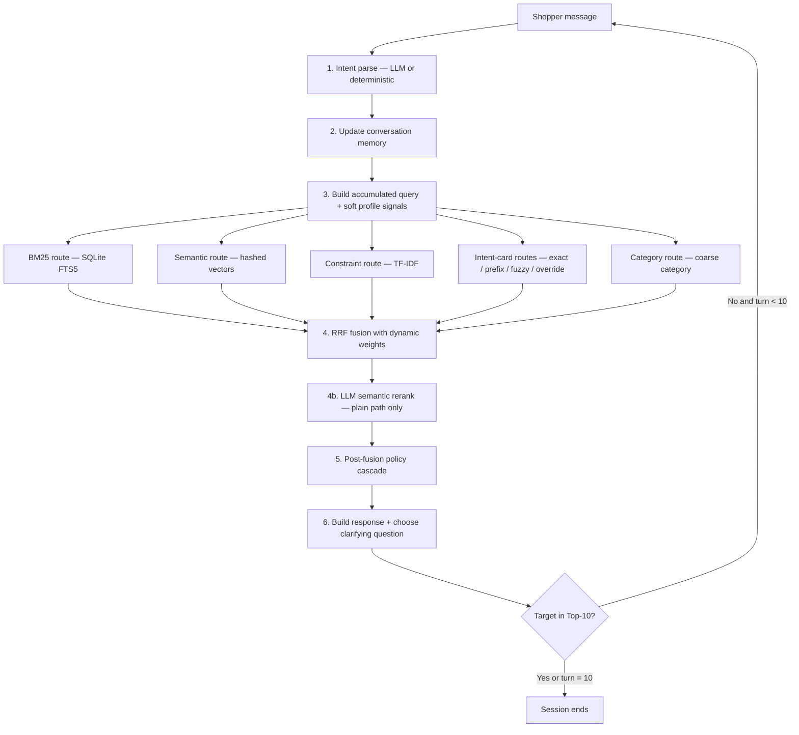

# TurnWise Shopping Copilot — Implementation Guide

## 1. Purpose

TurnWise is a conversational product-search agent for TechJam Track 4. A hidden
simulated shopper reveals what they want one reply at a time; the agent must
place the shopper's hidden **target product** inside a list of at most 10
`parent_asin` values, as high in that list as possible, in as few conversation
turns as possible.

The agent lives in `starter/agent.py`. It uses only the frozen product catalog
and the text revealed during the current conversation. It never reads evaluator
ground-truth labels or sample IDs. It optionally calls OpenAI `gpt-4.1-mini`
for two things — natural-language **intent parsing** and **semantic
reranking** — and falls back to a fully deterministic pipeline (no network,
byte-identical results) when no API key is present.

> New to the codebase? Read §2 (what score we optimise) and §11 (the
> glossary) first — every jargon term used in the code is defined there.

## 2. What the agent is scored on

The evaluator plays each session turn by turn. After every agent reply it checks
whether the hidden target appears in the Top-10 recommendations; the moment it
does, the session stops and the turn number is recorded. Four numbers come out:

| Metric | Meaning | Range |
|---|---|---|
| **HitRate@10** | Fraction of sessions where the target appeared in the Top-10 on *any* turn | 0–1, higher better |
| **MRR** (Mean Reciprocal Rank) | Average of `1 / rank` of the target in the list on the hit turn (rank 1 → 1.0, rank 10 → 0.1) | 0–1, higher better |
| **MTTC** (Mean Turns To Conversion) | Average turn number on which the target was found; a session that never hits counts as **11** | 1–11, lower better |
| **Efficiency** | `clip((11 − MTTC) / 10, 0, 1)` — MTTC rescaled to 0–1 | 0–1, higher better |

These combine into the single leaderboard number:

```text
TechnicalScore = 0.50 × HitRate@10 + 0.30 × MRR + 0.20 × Efficiency
```

Every design choice in this document is a trade-off between these three levers:
**find it at all** (HitRate), **rank it high** (MRR), and **find it early**
(Efficiency/MTTC). They pull against each other — showing one confident pick
maximises MRR but risks missing; showing ten diverse items maximises HitRate but
dilutes MRR. The turn-aware policy (§7) manages that tension.

## 3. System flow

Every shopper reply runs the same loop:



The agent returns recommendations **and** a clarifying question in the same
response, so it can keep narrowing while already exposing candidates.

## 4. Stage 1–2: Intent and memory

### 4.1 Intent parsing

Intent parsing is **LLM-first** via `HybridIntentParser`:

1. **OpenAI `gpt-4.1-mini`** receives the shopper message plus a compact state
   summary and returns structured JSON: `mode`, add/remove/negative
   constraints, no-preference signals, a confidence score, and a
   `suggested_question`.
2. **Deterministic fallback** — if the key is missing, the call times out or
   errors, or confidence `< 0.5`, a minimal parser returns `browsing`.

`mode` is one of three **session modes**:

- **browsing** — still exploring, few constraints given.
- **buying** — a price or several concrete requirements supplied.
- **override** — the shopper *replaces* an earlier preference ("actually…",
  "instead…", "ignore my earlier preference").

The prompt also carries **user-profile context** (a summary and preference tags
supplied at `reset()`), so the model interprets ambiguous replies in light of
who the shopper is. Full LLM architecture and failure modes:
`docs/llm_intent_architecture.md`.

### 4.2 Conversation memory

`ConversationMemory` is kept per `session_id` and is the agent's entire state.
Key fields (all defined in §11):

- `history` / `active_messages` — everything said vs. the messages currently
  driving retrieval;
- `intent` / `previous_intents` / `session_mode` — current and retired intents;
- `asked_counts` / `declined_attributes` — clarification bookkeeping;
- `negative_constraints` — explicit exclusions ("no leather");
- `boundary_signal` — shopper deferred to the agent's judgement;
- `last_override_turn` — the turn an override happened (drives `phase_turn`);
- `recommendation_ladder` / `ladder_position` — the stable Top-10 walk;
- `fuzzy_recommended` — items already shown on the fuzzy path;
- `suggested_question` — the LLM's proposed next attribute.

On an **override**, obsolete preferences are retired (not appended), the broad
opening category is preserved, and the recommendation ladder resets so
retrieval restarts cleanly against the replacement intent. "No preference"
replies are remembered as `declined_attributes` but kept out of the search
query, so "no preference for colour" never becomes a positive "colour"
requirement.

## 5. Stage 3–4: Retrieval and fusion

### 5.1 The retrieval routes

The accumulated query (built from `memory.query()`, optionally enriched on
turn 1 with up to three profile **preference tags** as soft terms) is sent to
several independent indexes. Each returns a ranked list of `parent_asin`s over
**visible catalog fields only**:

| Route | Class | Method | What it is good at |
|---|---|---|---|
| **BM25** | `BM25Index` | SQLite FTS5 full-text | Exact keywords, titles, brands, attribute words |
| **Semantic** | `InMemoryVectorIndex` | 256-d hashed vectors, cosine | Synonyms and meaning-level similarity |
| **Constraint** | `ConstraintIndex` | sparse TF-IDF postings | Several explicit hard requirements at once |
| **Intent-card: exact** | `IntentCardIndex.search` | exact clause postings | Requirements the simulator disclosed verbatim |
| **Intent-card: prefix** | `.prefix_search` | consecutive-clause prefix | Ordered disclosure — a longer matched prefix is stronger evidence |
| **Intent-card: fuzzy** | `.fuzzy_search` | token/bigram overlap × rarity | Paraphrased or reordered disclosures |
| **Intent-card: override** | `.override_search` | old-intent + new-clause reconcile | Recovering the target after an override |
| **Category** | `CategoryIndex` | exact coarse-category groups | Broad browsing and late-turn exploration |

**Intent cards** are per-product bundles of structured clauses (material,
colour, price, features) derived *only* from visible catalog fields — they
reproduce the *kind* of requirement the simulator discloses, without touching
hidden labels. The semantic encoder canonicalises equivalents before hashing
(`sneakers → shoe`, `comfy → comfortable`, `rainproof → waterresistant`).
Product vectors are built once at startup; only the live query is encoded per
turn. Constraint normalisation is Unicode-safe, so non-English catalog clauses
stay searchable.

### 5.2 The evidence route

The intent-card and constraint signals are folded into one composite ranking —
the **evidence route** — via a weighted RRF sum (weights in code at
`agent.py:1232`):

```text
evidence_score(p) =  1.75/(k+constraint_rank) + 1.00/(k+phrase_rank)
                   + prior_w/(k+prior_rank)   + card_w/(k+card_rank)
                   + 4.0/(k+category_card_rank)
                   + 8.0/(k+prefix_rank)       + 7.0/(k+fuzzy_card_rank)
```

`card_w` jumps to 4.0 (from 0.25) once **two or more** card clauses are
revealed; `prior_w` jumps to 4.0 after an override so the retired intent still
contributes. Prefix and fuzzy evidence carry the heaviest weights (8.0, 7.0)
because ordered/paraphrase-matched clauses are the strongest signal that a
product matches what the shopper actually described.

### 5.3 RRF fusion with dynamic weights

`HybridRanker.fuse()` merges four inputs — **BM25, semantic, evidence,
popularity** — using **Reciprocal Rank Fusion**:

```text
RRF(p) = Σ_route  route_weight / (fusion_k + rank_of_p_in_route)
```

A small **lexical quota** protects the top BM25 hit from being fused out.
Instead of fixed per-mode weights, `compute_weights()` adapts them to session
state:

| Signal | Adjustment | Why |
|---|---|---|
| Turn ≥ 5 | evidence +0.15, BM25 −0.10 | Late turns have accumulated constraints — trust structured evidence |
| Constraint count ≥ 3 | evidence +0.10, semantic −0.05 | Many constraints → exact matching beats similarity |
| Post-override, `phase_turn` ≤ 2 | semantic +0.15, evidence −0.10 | A fresh override has few structured signals yet |
| Preference tags present | semantic +0.05 | Tags add semantic context cosine search can use |

Weights are clamped to `[0.05, 1.0]`. `fusion_k` also adapts —
`max(5, base_k − 2 × constraint_count)` — so more constraints sharpen the
ranking. Base weights/​k live in `WEIGHTS` and `FUSION_K`, keyed by the
**routing intent** (`buying`/`browsing`/`override`/`boundary`). When the LLM is
off, the static base values are used unchanged, so the deterministic path is
identical to before.

### 5.4 LLM semantic reranking

When a key is present, `LLMReranker` reranks the fused list with a second
`gpt-4.1-mini` call. It receives **numbered product titles only** (no ASINs)
plus the query and profile, and returns a reordered index list; on any failure
the original RRF order is kept. Two efficiency guards (added after measuring
cost):

1. **Gating** — the reranker is skipped whenever a deterministic override path
   (prefix, fuzzy, or override-mode) is going to rebuild `ranked` in the
   cascade below anyway. Reranking there would be discarded work.
2. **Wide window** — on the plain path the reranker sees a wider fusion window
   (`RERANK_WINDOW = 30`, not just the Top-10), so it can *promote* a strong
   candidate from rank 11–30 rather than only reshuffle the Top-10.

Responses are SHA-256 cached. Measured effect of the two guards: score
0.9342 → **0.9384** and ~170k fewer tokens per 200-session run (see §9).

## 6. Stage 5: The post-fusion policy cascade

This is the heart of the agent and the part most easily misread from the code.
After fusion produces `ranked`, a sequence of conditional rewrites runs. Each
step only fires under its own guard; later steps override earlier ones. In
execution order:

1. **LLM rerank** (§5.4) — plain path only, gated.
2. **Prefix head** — if `prefix_search` returned anything, its top items are
   pinned to the front of `ranked` (they are the strongest ordered-disclosure
   matches), and the rest of `ranked` fills in behind.
3. **Fuzzy head** — else if `fuzzy_search` returned anything, its top items are
   pinned to the front the same way.
4. **Override-pair head** — after an override, once `phase_turn ≥ 3`, a slice
   of `override_search` results (skipping the first two already shown) is
   pinned to the front.
5. **Category exploration paging** — once the shopper has declined attributes
   and the session has passed its exploration-start turn, the agent keeps the
   single best pick as a head and pages *deeper* into the category list on each
   later turn (a moving `exploration_offset` window), so new coverage appears
   instead of the same items. Boundary sessions start deeper (offset 30).
6. **Prior-intent exploration** — after an override, `phase_turn ≥ 4`, page
   through the retired intent's results similarly.
7. **Override single-pick** — in the first two turns after an override
   (`phase_turn < 3`), show exactly one high-confidence pick from the override
   sources, to protect MRR while signals are still thin.
8. **Fuzzy single-mode** — when the fuzzy route is active, turns 1–9 each expose
   **one** new fuzzy candidate (walking down the list, tracked in
   `fuzzy_recommended`); **turn 10** switches to the coverage-maximising
   final-turn fill (§7.2).
9. **Deferral / early limit** — before `MIN_RECOMMEND_TURN` show nothing; before
   `FULL_RECOMMENDATION_TURN` show only `EARLY_RECOMMENDATION_LIMIT` (= 1) item.
10. **Recommendation ladder** — on the stable path from `FULL_RECOMMENDATION_TURN`
    onward, snapshot the Top-10 once into `recommendation_ladder`, then walk it:
    the first four positions are revealed one at a time (protecting MRR), then
    the remaining batch is returned, topped up with fresh candidates. A separate
    branch handles the boundary case (batch on the final turn).
11. **Buying deep-page** — once the ladder is exhausted and `phase_turn ≥ 8`, a
    buying session with prefix results pages further through them.
12. **Backfill** — if the list is still short of `response_limit`, top it up from
    BM25 + semantic results.
13. **Negative penalty** — items matching `negative_constraints` are pushed down.

The point of the cascade: expose the single most-confident item early (good
MRR), then broaden coverage turn by turn without reshuffling what the shopper
already saw (good HitRate and MTTC), with dedicated recovery paths for overrides
and paraphrases.

## 7. Turn-aware recommendation policy

### 7.1 Early vs. late turns

- **Early turns** (before `FULL_RECOMMENDATION_TURN`): one high-confidence
  candidate only — maximise MRR, avoid diluting the list before enough is known.
- **Middle turns**: walk the stable ladder one item at a time, then batch the
  rest — steady new coverage without churn.
- **Ask while showing**: the clarifying question and the recommendations are
  returned together, so the agent narrows and exposes candidates on the same
  turn (protects MTTC).

### 7.2 The final-turn (turn 10) fill

Turn 10 is special: there is no later turn to protect, so the goal flips from
precision to **coverage** of still-unseen candidates. The fill simply
**continues the fuzzy walk** — turns 1–9 each surfaced one new best candidate
(tracked in `fuzzy_recommended`), and turn 10 appends the next best still-unseen
candidates in rank order, drawing from the fuzzy, constraint, and (post-override)
category routes.

This *best-first* fill replaced an earlier scheme of hand-tuned rank windows
(`constraint_results[4:8]`, `fuzzy_card_results[13:17]`, `[23:27]`). Those
windows looked like memorised offsets, so they were tested against best-first in
a same-codebase A/B (only this block changed). Best-first was **equal on the
public set** (0.966400) and **slightly better on the unseen extended holdout**
(0.959927 vs 0.958767), so it generalises at least as well while carrying no
leakage-shaped constants — it was kept (comment at `agent.py:1392`).

> Note on stale figures: an earlier version of this doc reported a 0.9726
> deterministic baseline. That number predates the Gemini→OpenAI switch and was
> never re-measured; the true current-code deterministic default is **0.966400**
> (see §9).

## 8. Stage 6: Response, clarification, validation

### 8.1 Clarification strategy

`choose_question()` follows an **adaptive priority chain**:

1. **LLM-suggested attribute** — `suggested_question` from the intent parser,
   unless already asked or declined. Proactive and context-aware.
2. **Open-ended `other`** — up to 3 times, because one reply can reveal up to
   two hidden high-value constraints.
3. **Fixed fallback sequence**:
   `material → color → style → use_case → feature → budget → brand → size → category`.

Declined attributes are skipped at every level. A boundary reply ("use your
judgment") is stored as state, not added to the query.

### 8.2 Response contract

`ResponseBuilder.build()` returns exactly the evaluator contract:

```python
{
    "message": "What else matters most to you about the product?",
    "ask_attribute": "other",
    "recommendations": [{"parent_asin": "B000...", "score": 0.123}],
    "usage": {"prompt_tokens": 0, "completion_tokens": 0},
}
```

Guarantees: a natural-language message; one valid `ask_attribute`; ≤ 10 unique
`parent_asin`s; and cumulative session token usage (0 when no LLM key is set).

## 9. Verified results

Two modes. **Deterministic** uses no network and is the reproducible baseline.
**LLM-enabled** adds `gpt-4.1-mini` intent parsing + semantic reranking
(two calls per turn).

All figures below are re-measured on the **current OpenAI codebase**. (Earlier
docs quoted a 0.9726/0.9682 deterministic baseline; those predate the
Gemini→OpenAI switch and were never re-measured — they are superseded here.)

### Deterministic baseline (no API key, byte-identical across runs)

| Test set | Sessions | HitRate@10 | MRR | MTTC | Efficiency | TechnicalScore |
|---|---:|---:|---:|---:|---:|---:|
| Default public | 200 | 1.000 | 0.993333 | 2.580 | 0.8420 | **0.966400** |
| Extended holdout | 500 | 0.998 | 0.983490 | 2.706 | 0.8294 | **0.959927** |

### LLM-enabled (OpenAI `gpt-4.1-mini`, intent parsing + semantic reranking)

Two calls per turn, with the reranker gating + wide-window guards enabled.
Tokens = prompt + completion summed over all sessions; wall-clock is the full
eval run.

| Test set | Sessions | HitRate@10 | MRR | MTTC | Efficiency | TechnicalScore | Tokens | Wall-clock |
|---|---:|---:|---:|---:|---:|---:|---:|---:|
| Default public | 200 | 0.990 | 0.949643 | 3.075 | 0.7925 | **0.938393** | 1,249,783 | ~22.4 min |
| Extended holdout | 500 | _measuring — run in progress_ | | | | | | |

The gating + wide-window guards cut ~170k tokens versus the ungated pipeline
and lifted the default-public score from 0.934214.

**LLM mode is the default** (it runs whenever a key is present) and satisfies
the competition's "Multi-Route Retrieval → LLM Semantic Ranking" requirement.
Note the trade-off, though: its score sits **below** the deterministic
fallback, because the deterministic RRF ranker is already strongly tuned while
the reranker sees only product titles. So the automatic no-key fallback is not
just a safety net — it is currently the higher-scoring, zero-cost path.
Extended/persona splits were only measured deterministically (cost).

```text
Efficiency     = clip((11 − MTTC) / 10, 0, 1)
TechnicalScore = 0.50 × HitRate@10 + 0.30 × MRR + 0.20 × Efficiency
```

## 10. Setup and execution

Python 3.10+.

```bash
python -m pip install -r requirements.txt
```

**The mode is chosen automatically by the presence of a key — not by which
command you run.** At startup the agent calls `load_api_key()`, which looks for
`OPENAI_API_KEY` in the environment and then in a `.env` file:

- **Key found → LLM mode (the default).** The OpenAI intent parser and the
  semantic reranker are created and used on every turn.
- **No key → deterministic fallback.** The agent runs fully offline with zero
  network calls and zero token cost. This is *not* something you select; it is
  what happens when there is nothing to authenticate with.

So the normal/default workflow is: put your key in `.env`, then run **any** of
the commands below — they will all use the LLM. Remove or omit the key and the
exact same commands run deterministically.

```bash
# Put your key in .env at the project root (auto-read; never exported to prompts):
#   OPENAI_API_KEY=sk-...

# Official evaluator — uses LLM if a key is present, else deterministic
python -m evaluator.local_evaluator --catalog data/catalog.jsonl --output results.json

# Score against the default + extended datasets (same auto-detection)
python scripts/evaluate_datasets.py

# Tests (all LLM calls are mocked — no key or network needed)
python -m pytest tests/ -q
```

## 11. Glossary of terms

Every non-obvious term used in `starter/agent.py` and the docs:

| Term | Definition |
|---|---|
| **parent_asin** | The catalog product identifier the agent ranks and the evaluator scores against. |
| **target** | The hidden product the simulated shopper actually wants. Never visible to the agent. |
| **session mode** | The journey type held for the whole session: `browsing`, `buying`, or `override`. Set from the first decisive intent and not erased by later vague replies. |
| **routing intent** | The mode used to pick fusion weights *this turn*: `override` if post-override, else `boundary` if a boundary signal, else the session mode. |
| **intent (turn)** | The per-turn classification returned by `observe()` (may differ from session mode). |
| **override** | The shopper replaces an earlier preference. Triggers intent retirement, ladder reset, and the override retrieval/policy paths. |
| **phase_turn** | Turns elapsed *since* the last override (`turn − last_override_turn + 1`), or just `turn` if no override. Drives post-override timing. |
| **boundary_signal / boundary case** | The shopper deferred to the agent ("use your judgment"). Stored as state; shifts weights (`boundary` profile) and delays full recommendations. |
| **RRF (Reciprocal Rank Fusion)** | Combining ranked lists by summing `weight / (fusion_k + rank)` across routes. Rank-based, so incomparable route scores never need normalising. |
| **fusion_k** | The RRF denominator constant. Lower k = sharper (top ranks dominate more). Adapts down as constraint count rises. |
| **route / retrieval route** | One index's ranked output: BM25, semantic, constraint, the four intent-card variants, category, popularity. |
| **evidence route** | The composite structured ranking (§5.2) folding constraint + phrase + prior + card + prefix + fuzzy signals into one list, then fed into fusion. |
| **intent card** | A per-product bundle of structured clauses (material, colour, price, features) built from visible catalog fields only — the machine-readable form of a requirement. |
| **revealed constraints** | Card clauses the simulator has actually disclosed this session (parsed from "…what matters is: …" markers). |
| **exact / prefix / fuzzy / override search** | The four `IntentCardIndex` matchers: exact clause postings; longest *consecutive* revealed-clause prefix; rarity-weighted token/bigram overlap (paraphrase-tolerant); and old-intent + new-clause reconciliation after an override. |
| **prefix length** | How many leading card clauses of a product match the revealed clauses in order. Longer = stronger evidence. |
| **phrase / PhraseReranker** | A lightweight coverage re-ranker scoring how many query phrases a candidate covers; contributes `phrase_rank` to the evidence route. |
| **popularity prior** | `log1p(rating_count) × max(rating, 1.0)` per product — a static "generally-liked" tiebreaker route. |
| **lexical quota** | A reserved slot in the fused list guaranteeing the top BM25 hit is never fully fused out. |
| **preference tags / user profile** | Anonymous per-session shopper context from `reset()`. Feeds both LLM prompts and, on turn 1, the query as soft retrieval terms. |
| **soft signal / soft term** | A query term appended with low commitment (turn-1 profile tags) — enriches retrieval without becoming a hard filter. |
| **negative constraint** | An explicit exclusion ("no leather"); matching items are penalised (pushed down) at the end of the cascade. |
| **declined attribute** | An attribute the shopper said they have no preference on; remembered, skipped by clarification, kept out of the query. |
| **suggested_question** | The next attribute the intent LLM proposes to ask about; first choice in the clarification chain. |
| **recommendation ladder** | A once-snapshotted stable Top-10 the agent walks position by position, so successive turns add coverage without reshuffling seen items. |
| **ladder_position** | How far down the ladder has already been shown. |
| **fuzzy single-mode** | The regime where the fuzzy route is active and the agent reveals one new fuzzy candidate per turn (1–9), then the coverage fill on turn 10. |
| **fuzzy_recommended** | The set of items already shown on the fuzzy path, so the walk never repeats. |
| **exploration paging / offset** | Late-turn deep paging into the category (or prior-intent, or buying-prefix) list via a moving window, to surface never-seen candidates. |
| **head** | The pinned front of `ranked` a cascade step forces to the top (prefix head, fuzzy head, override-pair head, single-pick head). |
| **backfill** | Topping up a short list from BM25 + semantic results to reach `response_limit`. |
| **deferral** | Returning no recommendations on the earliest turn(s) (`MIN_RECOMMEND_TURN`) or for a just-declared override. |
| **RERANK_WINDOW / RRF_K / BM25_POOL** | Constants: rerank window depth (30); default fusion_k (20); candidate pool size per route (250). |
| **final-turn fill** | The turn-10 coverage strategy: continue the fuzzy walk, appending the next best still-unseen candidates in rank order (best-first). Replaced earlier hand-tuned rank windows after an A/B showed best-first generalises at least as well (§7.2). |

## 12. Runtime characteristics

- **Two LLM calls per turn** when enabled (intent + rerank), gated so the rerank
  is skipped whenever its output would be discarded.
- Key read from `.env`/`OPENAI_API_KEY` automatically; falls back to fully
  deterministic, network-free operation when unset.
- SHA-256 prompt caching on both LLM calls.
- All indexes in memory; BM25 uses an in-memory SQLite database; product vectors
  precomputed once at startup.
- Token usage tracked per session and reported in every response.
- Deterministic retrieval and ranking are byte-reproducible for a fixed catalog
  and conversation.

## 13. Data and leakage safety

The runtime agent contains no public/extended sample IDs, target ASIN mappings,
or target-specific rules, and never reads evaluator ground-truth labels. Ranking
uses only catalog fields, anonymous profile info, and conversation messages
supplied through the official interface. The final-turn fill (§7.2) is a
best-first continuation of the fuzzy walk — no hand-tuned rank constants, no
sample-specific rules. No ASINs are ever placed in an LLM prompt.

## 14. Main files

| File | Purpose |
|---|---|
| `starter/agent.py` | Complete agent: memory, retrieval routes, fusion, LLM rerank, policy cascade, response |
| `starter/intent_parser.py` | LLM intent layer (OpenAI + deterministic fallback) |
| `tests/test_agent_pipeline.py` | Intent, memory, retrieval, ranking, weights, rerank, clarification, contract tests |
| `tests/test_intent_parser.py` | Intent-parser unit tests (all mocked, no network) |
| `tests/test_adversarial_holdout.py` | Adversarial holdout schema tests |
| `tests/test_evaluator.py` | Evaluator normalisation and metric tests |
| `scripts/evaluate_datasets.py` | Score against default + extended datasets |
| `scripts/evaluate_robust.py` | Paraphrase/noise generalisation evaluator |
| `scripts/evaluate_splits.py` | Multi-split evaluator with locked-test safety |
| `evaluator/local_evaluator.py` | Official local evaluator (participant kit) |
| `docs/llm_intent_architecture.md` | LLM integration architecture and failure modes |
| `docs/agent_api_contract.json` | Official response contract |
| `docs/competition_reference.md` | Competition rules, metrics, submission requirements |

## 15. Future improvements

- Replace feature hashing with a compact local sentence-embedding model.
- Learn route weights from session-outcome features with strict cross-validation.
- Estimate question value from candidate-pool entropy (beyond LLM suggestion).
- Richer numeric parsing for size and price ranges.
- Cross-session profile learning (profiles are per-session today).
- Split `agent.py` into `state` / `intent` / `retrieval` / `ranking` / `policy`
  modules while keeping the official interface stable.
